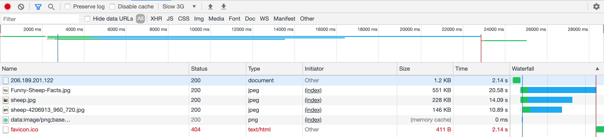
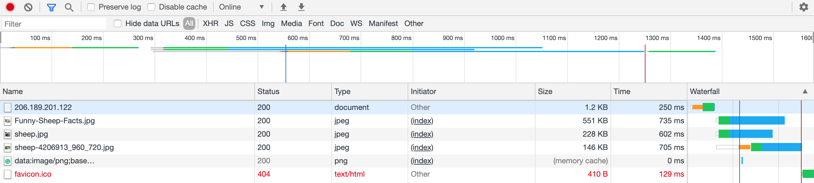
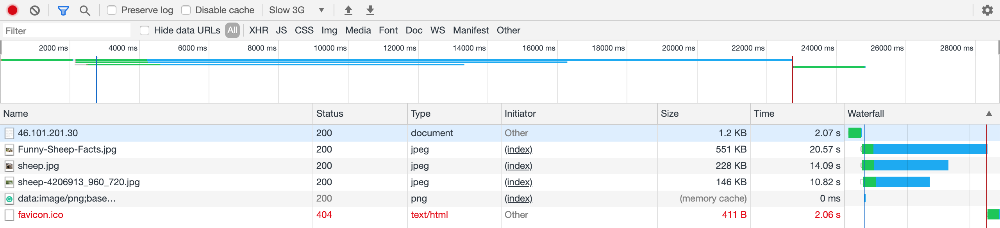
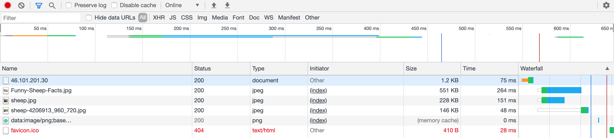
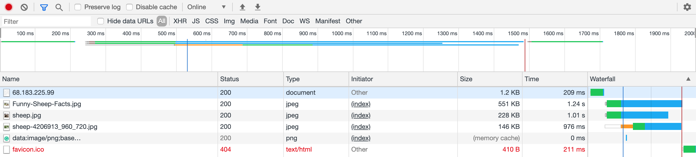
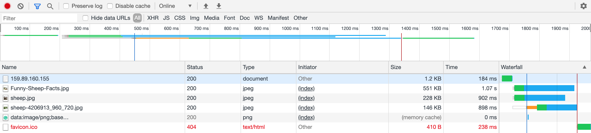

# Geo Locations Experiment :world_map: :artificial_satellite:
This repository provides thoughts about designing and setting up an experiment for reporting how the geographical location of a server and a client affects basic performance.

 

---
## Hypothesis :thought_balloon:
With this post, we would like to prove that the closer a client is to the server’s location, the faster the website would load. :signal_strength: We begin with the logical assumption that the geographical location would influence the time of a request due to that the physical transportation of the packages through cables would be grater for longer distances.

 

---
## Experiment :man_scientist::woman_scientist:
To test the hypothesis formulated above, we decided to create a basic HTML page containing some images and text. That exact page is being served in 4 different servers, each with their own location (**USA** :us:, **Germany** :de:, **Singapore** :singapore: and **India** :india:). With this set-up, we would try to prove that servers distributed around the world would serve the same page with differences in loading times :hourglass_flowing_sand:. A measurement would be taken with the resource to the Network recording of  Chrome development tools. This tool also enabled us to take the experiment to the next level by allowing us to cap the network throughput and therefore measuring time differences with more accuracy. We will execute this experiment using *slow 3G*, *fast 3G* and *not capped network speed* :balance_scale:. Between page reloads we always erased the cache of each page. All our tests are recorded in **Denmark** :denmark:, meaning that if you were to perform the same measurements your results may vary depending on your placement :globe_with_meridians:.

 

---
## Execute the experiment :satellite:
After the results were gathered from the Network tab, we summed  all the timings of each result to get a total page load time. Our observations can be seen in the table below:

||New York|Frankfurt|Singapore|Bangalore|
|:--:|:--:|:--:|:--:|:--:|
|slow 3G|49,84|49,63|50,15|50,01|
|fast 3G|14,014|13,677|14,085|14,721|
|online|2,421|0,566|3,646|3,292|
 

NY timings

 

<em>slow 3G</em>

<em>fast 3G</em>

<em>online</em>

FR timings

 

<em>slow 3G</em>

<em>fast 3G</em>

<em>online</em>

SIN timings

 

<em>slow 3G</em>

<em>fast 3G</em>

<em>online</em>

BAN timings

 

<em>slow 3G</em>

<em>fast 3G</em>

<em>online</em>

 

> Reproduce :computer: 

Here we present 2 options of reproducing our experiment:
1. Create 4 Digital Ocean droplets  in separate world locations - ex: New York, Frankfurt, Singapore, Bangalore. Within these droplets install Docker and use it to spin up a web-server where you would be serving the same HTML page throughout droplets. If you want to use our example you can find the file in the [website folder](website) folder.  

2. Use our already deployed servers [New York](http://206.189.201.122), [Frankfurt](http://46.101.201.30), [Singapore](http://68.183.225.99), [Bangalore](http://159.89.160.155).  

After following any of the previous approaches, just continue with checking the described experiment on how to perform the experiment and which tools to use throughout.

 

---
## Conclusion :memo:
After evaluating the experiment results, we can conclude that our hypothesis **held true** :medal_military: since some of our results display a difference of more than **3** seconds between the closest server to us (_601 km_) and the furthest one (_10,093 km_). It came as a surprise that there was an unintelligible difference between timings when it came to the slow and fast 3G part of the experiment. After giving it a thought, we have concluded that this was caused as a result of the server being able to relay data faster than the set internet speeds could consume it. However, when experimenting with the uncapped speed, the difference was very clear with the minimum timing difference being just short of 2 seconds :stopwatch:.

 

___
> #### Assignment made by:   
`David Alves 👨🏻‍💻 ` :octocat: [Github](https://github.com/davi7725)  
`Elitsa Marinovska 👩🏻‍💻 ` :octocat: [Github](https://github.com/elit0451)  
> Attending "Investigation & reporting (UFO)" course of Software Development bachelor's degree
